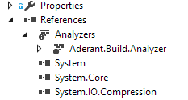

# Code Analysis #

A Roslyn C# code analyzer has been built to look for common code problems and offer to fix them.

The analyzer is installed into all C# projects via a special import in the project file. 
This MS Build import will load a special ```dir.proj``` file which is deployed during ```Get-Dependencies```.


Example import in a .csproj file:
 ``` 
 <Import Project="$(CommonBuildProject)\dir.proj" Condition="$(CommonBuildProject) != ''" />
 ```

 In Solution Explorer you will see the analyzer appear under the References/Analyzers node.

 

 Developers are encouraged to add rules this analyzer to catch common coding mistakes.
 
 Documentation on writing a rule and incorporating it into to the Analyzer package is available [here](https://aderant.sharepoint.com/:w:/r/RD/Platform/_layouts/15/doc2.aspx?sourcedoc=%7B4659A37A-FB41-43C6-B9A6-ABAC47800C1A%7D&file=Roslyn%20Rule%20Development%20%26%20Deployment.docx&action=default&mobileredirect=true&cid=8ede2fb2-b0ed-4825-b63d-ee661ab7bc9b). 