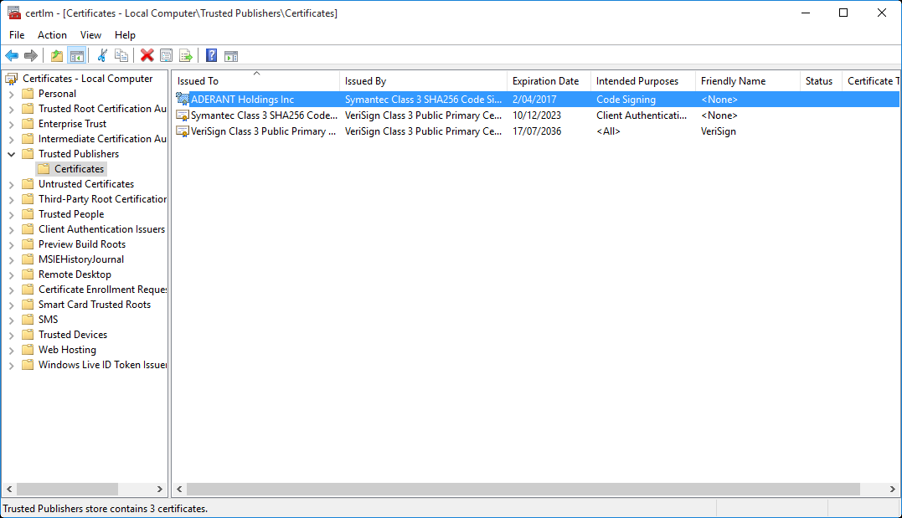
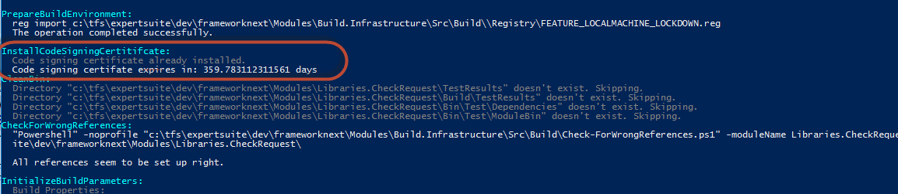
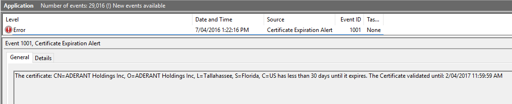

- [Code Signing](#code-signing)
    - [Certificate Installation](#certificate-installation)
    - [Certificate Expiry](#certificate-expiry)
- [Certificate Renewal](#certificate-renewal)

# Code Signing

Code signing is handled by Aderant.CodeSigning.targets
Code signing is done automatically by convention, any EXEs and ClickOnce files are signed with the current Aderant code signing certificate.

## Certificate Installation

IT push the code signing certificate out to all workstations via Active Directory. The certificate gets installed into the machine Trusted Publisher store. For the curious you can look at it via certlm.msc

## Certificate Expiry

The certificate is checked for validity on each build.

At 30 days before expiry the build will being emitting warnings that the certificate is due to expire.
At 14 days before expiry the build will fail requiring a new certificate to be published into Active Directory.
An entry is written to the build log and the Event Log on these two events to make it apparent why the build failed.

# Certificate Renewal

* Acquire a new Certificate
* Publish to Trusted Publishers via Active Directory
* Update CertificateHash in Aderant.CodeSigning.targets with the new SHA1 hash