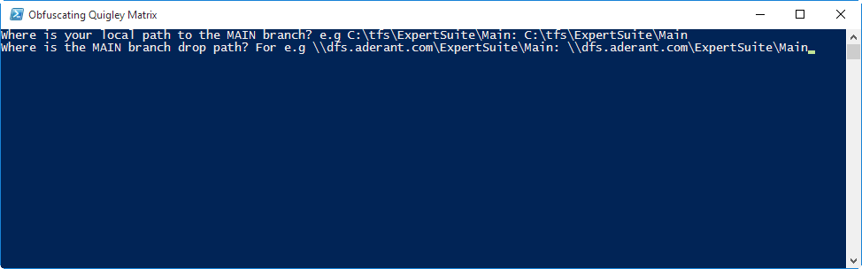

# First time setup

The first time you run the developer tools you will be asked some setup questions.
The drop location is the root path that the binaries are placed by the build servers for your branch. For main this path is ```\\dfs.aderant.com\ExpertSuite\Main\```



Once these values are set they can be changed via use of the ```Set-ExpertBranchInfo``` command.
For example, this will set your ```local path``` to ```C:\tfs\ExpertSuite\Main``` and the ```branch drop``` to ```\\dfs.aderant.com\ExpertSuite\Main```

```bash
Set-ExpertBranchInfo -devBranchFolder C:\tfs\ExpertSuite\Main -dropUncPath \\dfs.aderant.com\ExpertSuite\Main
```