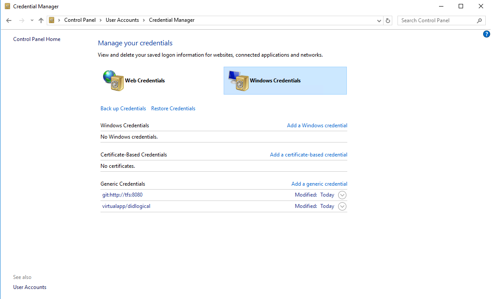
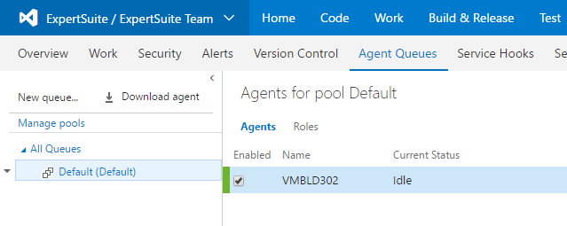

# Build agent provisioning 

Most of the setup required for a modern build agent is automated. 
This guide does not cover legacy build requirements such as those required by ClearView/Spotlight/Analytics which are using ancient build technology.

The process is something like this.

* Ask IT to provision a Server 2016 Expert Developer image
* Setup credential cache for Git
* Install TFS build agent
* Profit

The OS image comes with most of the requirements needed to build Expert software. Such as MS Build, Visual Studio and the Modeling SDK.

## Setup credentials
Logon to the machine and register a set of credentials which Git will use to communicate with TFS.

From PowerShell

```
Install-Module CredentialManager    
New-StoredCredential -Target "git:http://tfs:8080" -Persist LocalMachine -Credentials (Get-Credential)
```

This will install a credential into the Windows Credential Manager.



## Install the agent

From TFS > Admin > Agent Queues click "Download Agent"



Copy the agent zip onto the build machine and extract the zip.