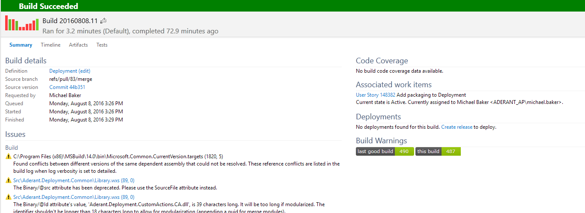

# Warning Ratchet #

For VNext builds (those not listed under "XAML Builds" in Visual Studio), warning ratcheting has been instated.
Warning ratcheting is part of the code quality drive to ensure we always build and ship the highest quality code. 

## How does it work? ##

The number of warnings emitted by the build process are recorded during a server build on the ```master``` branch.
When any other branch is built against the same repository, the warning count of that build instance is compared against the last good build on ```master```.
If the number of warnings is greater than the base line the build is failed.

The basic idea is builds can never accrue technical debt via warnings but instead can only stay the same, or get better.

