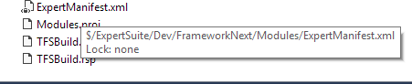

# Expert Build Infrastructure #
Welcome to the Expert build system. This repository contains the source code and documentation for the tools and workflows which compile, build, lint and test the Expert Suite code base.

## Getting Started aka Before You Do Anything ##
The tools provide a set of PowerShell extensions which enable you to retrieve dependencies for products, compile the projects and run the tests.

Assuming you already have Git and [PowerShell 5.0](https://www.microsoft.com/en-us/download/details.aspx?id=50395) installed.

* Start PowerShell or a Command Prompt
* Clone the repository 
```git clone http://tfs:8080/tfs/Aderant/ExpertSuite/_git/Build.Infrastructure C:\Source\Build.Infrastructure```
* Change directory 
```cd C:\Source\Build.Infrastructure```
* Run 
```profilesetup.cmd```

This will install and configure the developer tools. 
The next time you start PowerShell you will be asked a series of questions which will configure the tools for you.

### What's new? ###

The Build Infrastructure module has now been extracted from TF VC and elevated to a common set of build automation services and libraries. 
To support this there are a number of changes to the current development cycle.

In the previous model each branch has a copy of Build.Infrastructure. The tooling would use the scripts and data from the currently selected branch.
For example, if your branch context was ```Dev\MyBranch``` then the GetProduct.ps1, ExpertManifest.xml etc. would be used from this branch.
To support the isolation of Build Infrastructure it was necessary to move the Expert Manifest out of Build.Infrastructure.
The manifest describes the contents of your branch and how to perform product assembly. While this concept of a manifest will be replaced in time, for now it needs to stay. 

The change of the manifest location means a change to the development workflow. 

Previously dev and QA would need to "get latest" on the Build.Infrastructure module. 
You now need the latest manifest for your branch which is located ```$/ExpertSuite/<folder>/<branch>/Modules/ExpertManifest.xml```



 * [Warning Ratchet](./Doc/Warning-Ratchet.md)

### Getting Started with Git Integration ###

Assuming you have cloned a repository you can manage it using most of the existing build commands such as ```gd```.

For example, to work with the Deployment repository set the build context using ```.```

```
cd C:\Source\Deployment
cm .
```

The first time you use use the Git integration you will be asked to install [Posh-Git](https://github.com/dahlbyk/posh-git) from the PowerShell Gallery. 
When asked if you trust the PowerShell Gallery answer ```Y```.

> You are installing the module(s) from an untrusted repository. If you trust this repository, change its InstallationPolicy value by running the Set-PSRepository cmdlet.
> Are you sure you want to install software from 'https://www.powershellgallery.com/api/v2/'?
> [Y] Yes  [A] Yes to All  [N] No  [L] No to All  [S] Suspend  [?] Help (default is "N"): y

[Posh-Git](https://github.com/dahlbyk/posh-git) enhances the Git experience by adding tab completion for commands.